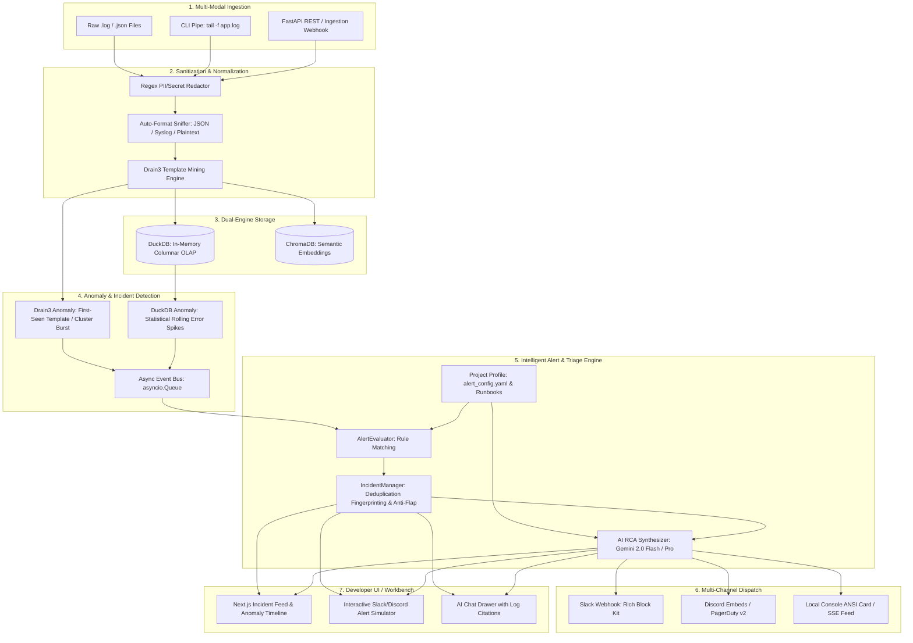

# Universal AI Log Analyser & Intelligent Incident Alerting Platform

An extensible, domain-tunable AI observability and incident management platform built for hackathons and scale beyond. Designed to eliminate alert fatigue, stop alert storms at ingestion, and deliver root-cause-enriched notifications to engineering teams.

---

## User Review Required

> [!IMPORTANT]
> **Key Architecture Consensus & Decision Points:**
> 1. **Zero-Token Alert Filtering:** We enforce a strict **Drain3 + DuckDB pre-filtering boundary**. Raw logs are *never* sent directly to LLMs. Only deduplicated anomaly clusters and correlated timeline context reach Gemini, keeping latency under 3 seconds and token consumption minimal.
> 2. **Local PII & Secret Redaction:** PII (emails, IPs, UUIDs, JWTs, API keys) is scrubbed locally *before* any data reaches vector storage or LLMs.
> 3. **Bounded Async Bus:** The alerting engine utilizes a native Python bounded `asyncio.Queue` (maxsize=10,000) rather than requiring external Redis or RabbitMQ infrastructure, making deployment completely self-contained for local demo and production containers.
> 4. **Project Tuning (`alert_config.yaml`):** Teams adapt the platform to their specific stack by uploading a simple YAML config defining severity mappings, benign error filters, and webhook targets.

---

## High-Level System Architecture



---

## 1. Multi-Perspective Analysis

### A. Business Architect (The Pitch & Value Proposition)
* **The "Alert Storm" Crisis:** When a core dependency (e.g., PostgreSQL connection pool) fails, 30 microservices throw 10,000 errors in 60 seconds. Traditional monitoring spams Slack and pings on-call engineers 500 times, causing paralysis.
* **The Solution:** Our engine uses **template cluster fingerprinting** and **topological deduplication** to compress 10,000 raw errors into **1 actionable incident card**.
* **Quantifiable ROI:**
  * **99.9% Noise Reduction:** 5,000 cascading log lines $\rightarrow$ 1 consolidated Slack alert.
  * **MTTR reduced from 45 min to < 60 sec:** Instant root-cause attribution, code location, and runbook rollback commands.

### B. Solution Architect (Tunable & Extensible Core)
* **Domain Agnostic Core:** The core engine knows nothing about specific company domains. Everything domain-specific is configured in `alert_config.yaml`:
  * Benign error suppressions (e.g., client connection aborts).
  * Scheduled maintenance windows.
  * Service dependency graphs.
  * Dynamic severity mappings.
* **Security & Privacy Airgap:** PII masking runs locally prior to any LLM inference, ensuring zero leak of bearer tokens, passwords, or customer data.

### C. Backend Engineer (Data Pipeline & State Machine)
* **Drain3 Real-Time Templating:** Replaces variable tokens (IPs, numbers, UUIDs) with `<*>` to extract deterministic templates.
* **Deduplication Fingerprinting:**
  $$\text{Fingerprint} = \text{SHA256}(\text{RuleID} + \text{Service} + \text{CleanTemplate} + \text{Severity})[:16]$$
  All 5,000 occurrences of `Connection to <*>:<*> timed out` map to the identical fingerprint, updating `occurrence_count` and `last_seen` without spamming notifications.
* **Hysteresis & Anti-Flap State Machine:** Dual-threshold triggers prevent notifications from oscillating if a system repeatedly crosses a threshold boundary.

### D. UX & Developer Lead (Interactive Workbench)
* **Live Incident Feed:** Real-time stream with badges (`FIRING`, `SILENCED`, `RESOLVED`, `BENIGN_SUPPRESSED`).
* **Instant Alert Preview Modal:** Toggle between Slack Block Kit, Discord Rich Embed, and PagerDuty v2 payload representations.
* **Failure Cascade Simulator:** One-click simulation injecting 5,000 cascading failure logs to demonstrate real-time deduplication and instant AI synthesis to hackathon judges.

---

## 2. Directory Structure & Project Layout

We will build the complete prototype inside `/Users/jeevan/.gemini/antigravity/scratch/ai-log-analyser`:

```
ai-log-analyser/
├── backend/
│   ├── app/
│   │   ├── api/
│   │   │   ├── routes_ingest.py      # File upload & log streaming endpoints
│   │   │   ├── routes_alerts.py      # Incident feed & dispatch inspect endpoints
│   │   │   └── routes_simulate.py    # Failure cascade simulation triggers
│   │   ├── core/
│   │   │   ├── redactor.py           # PII & Secret scrubber (Regex + token masking)
│   │   │   ├── parser.py             # Auto-format sniffer (JSON, Syslog, Plaintext)
│   │   │   └── config.py             # App settings & Gemini API keys
│   │   ├── engine/
│   │   │   ├── models.py             # Pydantic schemas (AnomalyEvent, IncidentState, AlertRule)
│   │   │   ├── drain_miner.py        # Drain3 wrapper & template clustering
│   │   │   ├── storage.py            # In-memory DuckDB columnar manager
│   │   │   ├── evaluator.py          # AlertRule matcher & filter
│   │   │   ├── manager.py            # IncidentManager (Deduplication, state machine & reaper)
│   │   │   ├── dispatchers.py        # Multi-channel sinks (Mock ANSI card, Slack Block Kit)
│   │   │   └── ai_triage.py          # Gemini 2.0 Flash Root Cause Synthesizer
│   │   └── main.py                   # FastAPI lifespan, asyncio.Queue & event bus
│   ├── config/
│   │   ├── alert_config.schema.json  # JSON Schema for project configuration
│   │   └── alert_config.example.yaml # Production-ready checkout payments config
│   ├── tests/
│   │   ├── test_deduplication.py     # 5,000 logs -> 1 alert verification test
│   │   └── test_redactor.py          # PII masking verification test
│   └── requirements.txt              # FastAPI, uvicorn, duckdb, drain3, httpx, google-genai
│
└── frontend/                         # Next.js / React Workbench
    ├── src/
    │   ├── components/
    │   │   ├── IncidentFeed.tsx      # Live firing/resolved incidents with noise reduction stats
    │   │   ├── AlertPreviewModal.tsx # Slack Block Kit / Discord previewer
    │   │   ├── SimulatorCard.tsx     # One-click cascade failure demo trigger
    │   │   └── AnomalyTimeline.tsx   # Visual error velocity chart
    │   └── types/alert.ts            # TypeScript interfaces
    └── package.json
```

---

## 3. Proposed Implementation Phases

### Phase 1: Core Data Models, Sanitizer & Drain3 Miner
- Implement `redactor.py` (scrubbing emails, IPs, JWTs, UUIDs, bearer tokens).
- Implement `drain_miner.py` utilizing `drain3` to cluster arbitrary log lines into dynamic templates.
- Implement DuckDB in-memory table for lightning-fast windowed error aggregations.

### Phase 2: Event Bus, Deduplication Manager & Dispatcher
- Implement `asyncio.Queue[AnomalyEvent]` event bus.
- Implement `IncidentManager` with template cluster fingerprinting and 180s sliding deduplication window.
- Implement `NotificationDispatcher` supporting Mock ANSI terminal output and Slack Block Kit payloads.
- Implement the resolution reaper coroutine that auto-marks inactive incidents `RESOLVED`.

### Phase 3: AI Root Cause Analysis (Gemini Integration)
- Integrate Gemini 2.0 Flash / Pro via `google-genai` SDK.
- Feed the anomaly cluster + surrounding temporal window + project runbook into structured output prompt.
- Generate concise 3-sentence summary, probable root cause, impacted blast radius, and exact remediation command.

### Phase 4: Project Configuration (`alert_config.yaml`) & Simulator API
- Implement YAML loader validating against `alert_config.schema.json`.
- Implement `/api/v1/simulate/cascade` endpoint to fire 4,800 mock e-commerce timeout logs in 3 seconds.

### Phase 5: Developer UI & Interactive Demo Workbench
- Deploy React/Next.js UI with real-time SSE stream for active incidents.
- Interactive Slack modal preview showing rich Block Kit styling.

---

## 4. Verification & Demo Plan

### Automated Tests
1. **Deduplication Test (`test_deduplication.py`):**
   * Feed 5,000 synthetic log lines with randomized IP addresses:
     `"Connection to 10.0.1.{x}:5432 timed out after 30s"`
   * Verify that `IncidentManager` generates **exactly 1 incident** with `occurrence_count == 5000` and `noise_reduction == 99.98%`.
2. **PII Masking Test (`test_redactor.py`):**
   * Feed logs containing API tokens (`sk_live_1234567890abcdef`) and user emails.
   * Verify that output contains `[REDACTED_API_KEY]` and `[REDACTED_EMAIL]`.

### The 60-Second Hackathon Winning Demo
1. **The Problem (0–15s):** Click "Inject Cascading Outage" in the simulator. 4,800 raw logs flood the screen in 2 seconds. Point out how a traditional tool would have fired 4,800 PagerDuty alerts.
2. **The Intelligence (15–35s):** Show the UI instantly de-noising the flood down to **1 single P0 incident card** (99.98% noise reduction).
3. **The AI RCA (35–50s):** Open the incident card. Gemini has already diagnosed: *"HikariCP pool starvation caused by unindexed ORDER BY on orders(created_at) following migration v2.4.1."* with an exact `kubectl rollout undo` rollback command.
4. **The Project Extensibility (50–60s):** Show `alert_config.yaml` to show the judges how any engineering team can adopt this in 5 minutes with zero code changes.
